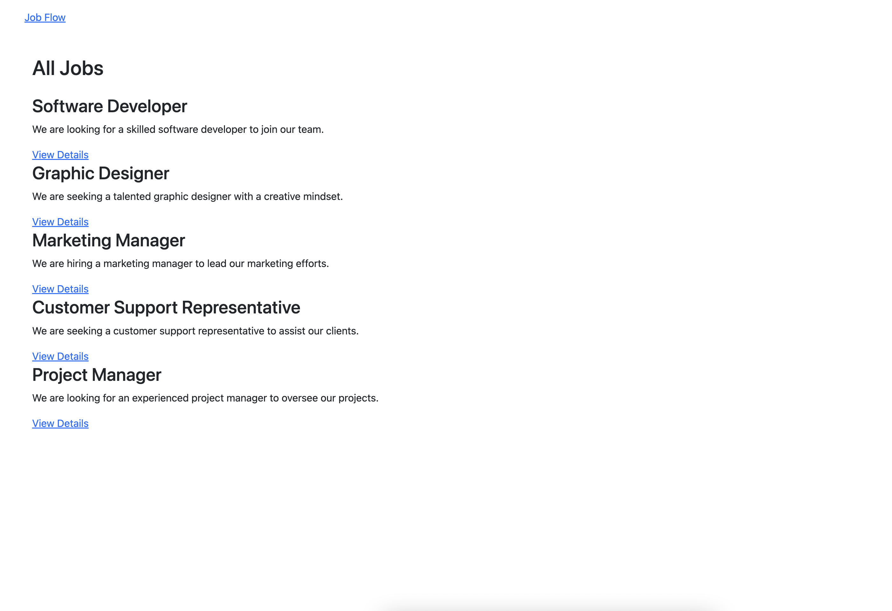

# Demo Description

## Create a Model and Migration for Job
## Implement Controller Functions for 
### Creating A Job
### Getting All Jobs
### Getting A Job By Id

### Create Frontend (using AJAX) for 
- Creating A Job
- Getting All Jobs
- Getting A Single Job 

### Special Note
    - Routes/api, Routes/web
    - Controllers/JobControllers
    - Models/Job
    - database/migration/create-jobs-table

### Screens

